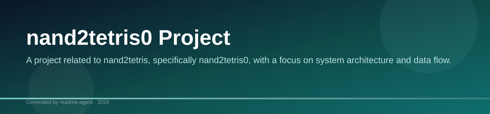
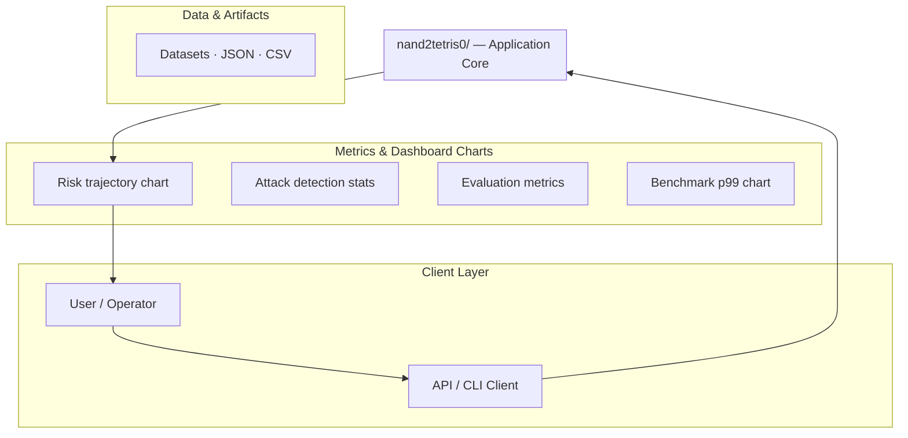
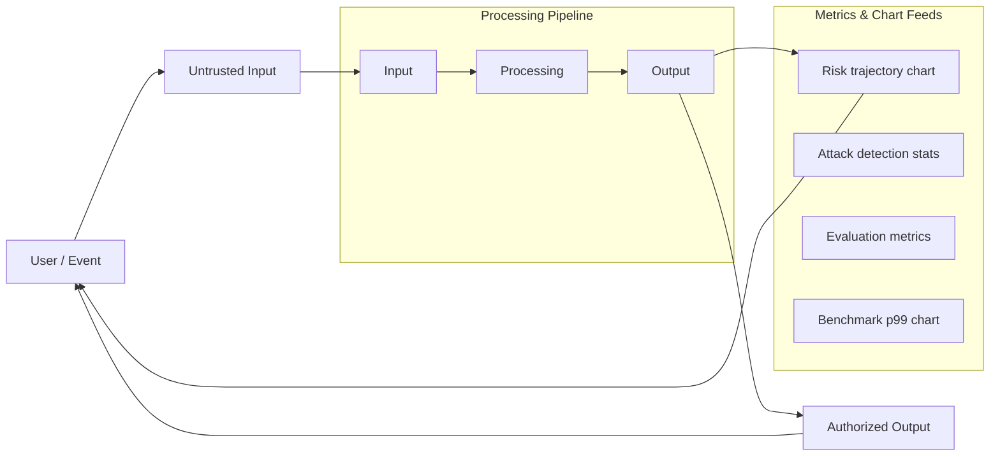
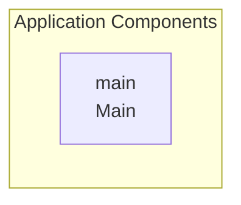

# nand2tetris0

A project related to nand2tetris, specifically nand2tetris0.

## Overview

The repository is titled nand2tetris0 and appears to be part of a larger educational or hardware design project called nand2tetris. The current evidence only shows a README file with the title 'nand2tetris' and 'nand2tetris0'.

## Key Features

- nand2tetris0

## nand2tetris0

A project related to nand2tetris, specifically nand2tetris0.

### Overview

The repository is titled nand2tetris0 and appears to be part of a larger educational or hardware design project called nand2tetris. The current evidence only shows a README file with the title 'nand2tetris' and 'nand2tetris0'.

### Features

*   nand2tetris0

### Limitations

*   The repository contains minimal files and no source code or dependencies are visible to determine the project's functionality.

## Setup Guide

_Setup commands could not be extracted from the repository._

## System Architecture

High-level system design, data flows, API map, and workflow pipelines derived from the repository structure.

### System Architecture

### Data Flow & Charts Pipeline

### Component & API Map

