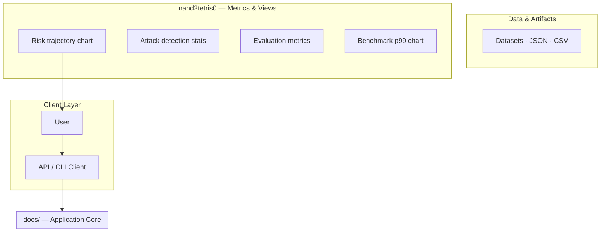
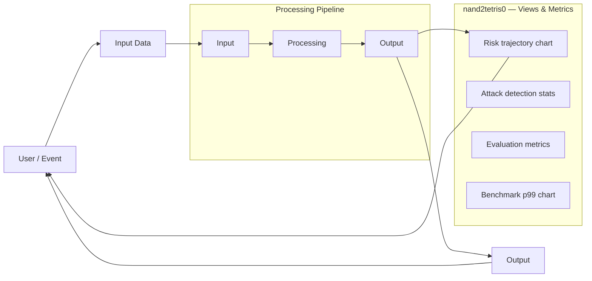
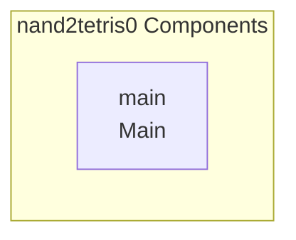

# nand2tetris0 Project

A project related to nand2tetris, specifically nand2tetris0, focusing on system architecture and data flow within the nand2tetris educational framework.

## Overview

The `nand2tetris0` repository is designed as a complex system component within the larger nand2tetris educational or hardware design project. It models a system involving a Client Layer, an Application Core, and various data/metrics dashboards. The system processes untrusted input through a defined pipeline to generate authorized output and update multiple monitoring metrics.

## Limitations

*   The repository contains minimal files and no source code or dependencies are visible to determine the project's functionality.

## Setup Guide

_Setup commands could not be extracted from the repository._

## System Architecture

High-level system design, data flows, API map, and workflow pipelines derived from the repository structure.

### System Architecture

### Data Flow & Charts Pipeline

### Component & API Map

